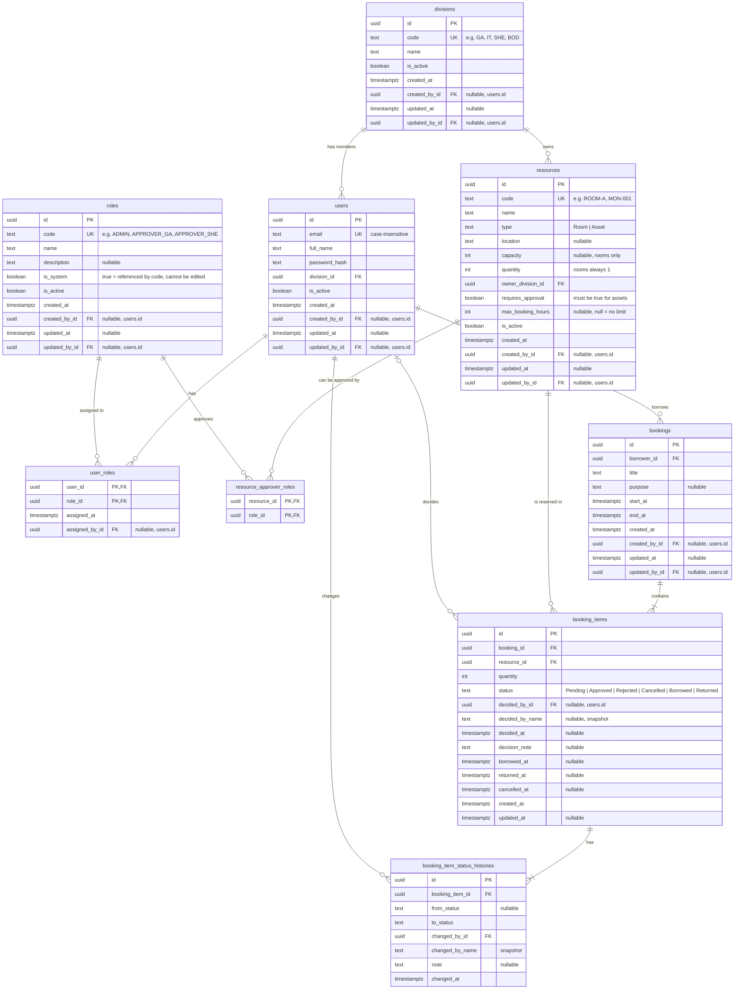

```mermaid
erDiagram
    divisions ||--o{ users : "has members"
    divisions ||--o{ resources : "owns"
    users ||--o{ user_roles : "has"
    roles ||--o{ user_roles : "assigned to"
    resources ||--o{ resource_approver_roles : "can be approved by"
    roles ||--o{ resource_approver_roles : "approves"
    users ||--o{ bookings : "borrows"
    bookings ||--|{ booking_items : "contains"
    resources ||--o{ booking_items : "is reserved in"
    users |o--o{ booking_items : "decides"
    booking_items ||--|{ booking_item_status_histories : "has"
    users ||--o{ booking_item_status_histories : "changes"

    divisions {
        uuid id PK
        text code UK "e.g. GA, IT, SHE, BOD"
        text name
        boolean is_active
        timestamptz created_at
        uuid created_by_id FK "nullable, users.id"
        timestamptz updated_at "nullable"
        uuid updated_by_id FK "nullable, users.id"
    }

    roles {
        uuid id PK
        text code UK "e.g. ADMIN, APPROVER_GA, APPROVER_SHE"
        text name
        text description "nullable"
        boolean is_system "true = referenced by code, cannot be edited"
        boolean is_active
        timestamptz created_at
        uuid created_by_id FK "nullable, users.id"
        timestamptz updated_at "nullable"
        uuid updated_by_id FK "nullable, users.id"
    }

    users {
        uuid id PK
        text email UK "case-insensitive"
        text full_name
        text password_hash
        uuid division_id FK
        boolean is_active
        timestamptz created_at
        uuid created_by_id FK "nullable, users.id"
        timestamptz updated_at "nullable"
        uuid updated_by_id FK "nullable, users.id"
    }

    user_roles {
        uuid user_id PK, FK
        uuid role_id PK, FK
        timestamptz assigned_at
        uuid assigned_by_id FK "nullable, users.id"
    }

    resources {
        uuid id PK
        text code UK "e.g. ROOM-A, MON-001"
        text name
        text type "Room | Asset"
        text location "nullable"
        int capacity "nullable, rooms only"
        int quantity "rooms always 1"
        uuid owner_division_id FK
        boolean requires_approval "must be true for assets"
        int max_booking_hours "nullable, null = no limit"
        boolean is_active
        timestamptz created_at
        uuid created_by_id FK "nullable, users.id"
        timestamptz updated_at "nullable"
        uuid updated_by_id FK "nullable, users.id"
    }

    resource_approver_roles {
        uuid resource_id PK, FK
        uuid role_id PK, FK
    }

    bookings {
        uuid id PK
        uuid borrower_id FK
        text title
        text purpose "nullable"
        timestamptz start_at
        timestamptz end_at
        timestamptz created_at
        uuid created_by_id FK "nullable, users.id"
        timestamptz updated_at "nullable"
        uuid updated_by_id FK "nullable, users.id"
    }

    booking_items {
        uuid id PK
        uuid booking_id FK
        uuid resource_id FK
        int quantity
        text status "Pending | Approved | Rejected | Cancelled | Borrowed | Returned"
        uuid decided_by_id FK "nullable, users.id"
        text decided_by_name "nullable, snapshot"
        timestamptz decided_at "nullable"
        text decision_note "nullable"
        timestamptz borrowed_at "nullable"
        timestamptz returned_at "nullable"
        timestamptz cancelled_at "nullable"
        timestamptz created_at
        timestamptz updated_at "nullable"
    }

    booking_item_status_histories {
        uuid id PK
        uuid booking_item_id FK
        text from_status "nullable"
        text to_status
        uuid changed_by_id FK
        text changed_by_name "snapshot"
        text note "nullable"
        timestamptz changed_at
    }
```